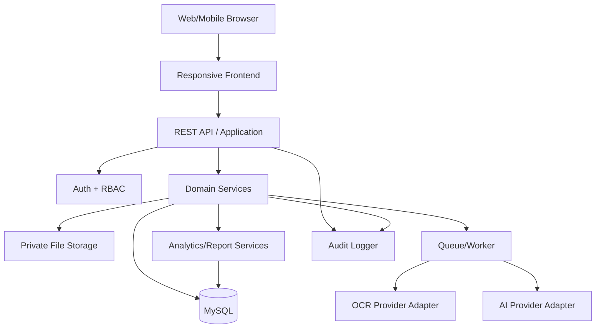

# System Architecture

## Layers
1. Presentation: Blade/JS or SPA UI
2. API/Application: controllers, requests, policies
3. Domain: Charging, Tariff, Cost, Receipt, Analytics services
4. Infrastructure: MySQL, storage, queue, OCR/AI adapters
5. Cross-cutting: auth, audit, logging, validation

## Recommended Project
Laravel 12+ / PHP 8.3+ / MySQL 8+ / Redis optional / queue worker / private filesystem.

## Services
- ChargingSessionService
- CostCalculationService
- TariffService
- ReceiptService
- OCRService
- ReceiptParserService
- DuplicateDetectionService
- AnalyticsService
- ReportService
- AuditLogService
- NotificationService

## OCR Provider Adapter
`OcrProviderInterface`
Implement providers independently. Never couple domain code to a vendor SDK.

## AI Provider Adapter
`AiProviderInterface`
Return structured, validated output. AI is advisory; deterministic business rules remain authoritative.

## Data Flow
Manual:
UI -> API -> validation -> transaction -> DB -> analytics refresh.

Receipt:
UI -> upload -> private storage -> queue -> OCR -> parser -> confidence -> duplicate check -> review -> verify -> transaction -> DB.

## Deployment
Nginx/Apache -> PHP-FPM -> Laravel -> MySQL
Queue worker handles OCR/AI.
Scheduler handles reports, notifications and backups.
