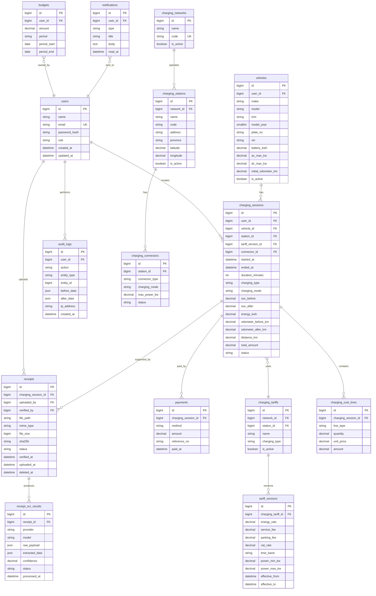

# Database ERD

> Corrected during M1: `effective_from` / `effective_to` were shown on
> `charging_tariffs`, which contradicted `database/schema.sql` and the
> versioning design. The effective period belongs to `tariff_versions` --
> that is what makes a historical session reproducible (AT-006).

